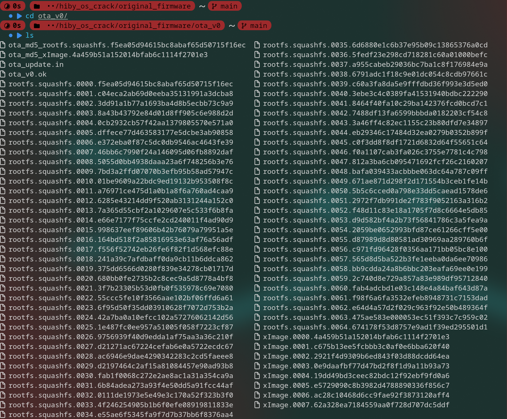
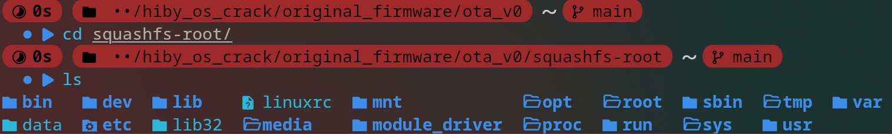

# HiBy OS Crack
Cracking the firmware of HiBy's linux devices

## Scope
- For now, this project focuses on the HiBy R3ProII, as it's the only one I have. As far as I know, there are some minor differences between the firmwares on the different HiBy linux devices, but most things apply universally.
- The goal of this project is to make it possible to modify the HiBy OS firmware to add custom functionality.

### Note for Windows
For equivalent functionality on Windows, please see `docs/WIN_INSTALL.md`.

## Workflow
**For HiBy R3Proii**
- go to `r3proii/unpacking_and_repacking`
- run `unpack.sh` (it will ask for sudo permissions for part of the script). this will create a gitignored folder called `squashfs-root`.
- modify the contents of `squashfs-root` to make whatever custom firmware you want
- run `repack.sh` (it will ask for sudo permissions for part of the script). this will create a gitignored file called `r3proii.upt`
- flash that firmware file onto the device (how to do that is explained below)

**Workflow Notes**
- `squashfs-root` represents the root filesystem that will be flashed with the firmware.
- most/all of the files in `squashfs-root` will be owned by `root`, so it can be annoying to modify sometimes. This is also why it's gitignored
- `r3proii.upt` is the firmware file

## Unpacking the firmware
**dependencies**
- 7zip (for `7z` command) (could probably use other tools instead)
- squashfs-tools (for `unsquashfs` command)
- binwalk (to extract uImage. it's overkill for this, but it does all of the uImage extraction work automatically)
- vmlinux-to-elf (for formatting the kernel to use with qemu)

**script**

There is a script that does this automatically located in `r3proii/unpacking_and_repacking`

**extracting the upt file**
- The original firmware file is `r3proii.upt`. It's an ISO image.
- To extract that image, run `7z x r3proii.upt`
- That will have created a file and a folder. The file, `ota_config.in`, just says "current_version=0". The folder, `ota_v0/`, contains a bunch of stuff

- There are a bunch of squashfs files, and a bunch of xImage files

**extracting the squashfs file**
- The squashfs files need to be concatenated to get the actual squashfs file that can be extracted
- To concatenate the squashfs files into one, run `cat rootfs.squashfs.* > rootfs.squashfs.all`. This created a new file called `rootfs.squashfs.all` that includes all of the concatenated data.
- To extract the squashfs file, run `sudo unsquashfs rootfs.squashfs.all`. This will create a new folder called `squashfs-root`
    - ***Note: Due to the file permissions in `squashfs-root`, you will likely need sudo permission in order to write to many of the system files***
    - Running this command with sudo is needed in order to maintain the original file ownership and permissions. This is required in order to make a working repack of the firmware.
    - If run without sudo, the rootfs will be extracted just file, but with all of the file permissions set to your user.
- The `squashfs-root` folder is what acts as the linux root directory on the device when firmware is flashed

**extracting the xImage file**
- To concatenate the xImage files into one, run `cat xImage.* > xImage.all`. This creates a new file called `xImage.all` that contains the concatenated data
- `xImage.all` is a u-boot image that contains a raw binary for the linux kernel
- To extract the kernel binary from the uImage, run `dd if=xImage.all of=Linux-4.4.94+.bin bs=64 skip=1`. that will create a file called `Linux-4.4.94+.bin`
- qemu wants the kernel in elf format, so we need to turn the raw binary into an elf file
- to do that, run `vmlinux-to-ekf Linux-4.4.94+.bin Linux-4.4.94+.elf`

## Repacking the Firmware
**requirements**
- 7zip (for `7z` command) (could probably use other tools instead)
- squashfs-tools (for `mksquashfs` command)
- cdrtools (for the `mkisofs` command)

**script**

There is a script that does this automatically located in `r3proii/unpacking_and_repacking`.

Just look at the script to see how it works, it should be pretty well commented.

## Updating the Firmware
**Placing the Firmware on the Device**
- Place the firmware (`.upt` file) in the root directory of the SD card
    - It is fine to leave other files/folders (such as music) on the SD card. Just make sure the firmware is in the root of the SD card
    - Can be done by removing the SD and using it directly, or over USB, (TODO) might also be possible to do through http site
- Perform the update using one of the methods below

**Common Problems, Symptoms, and Fixes**
- **IMPORTANT** After the upgrade finishes successfully, the device should start on its own after only a few seconds. If it doesnt, use one of the failsafe methods below to upload fixed firmware. As far as I can tell, it's impossible for a firmware update to cause the device to enter an unrecoverable state.
- If something is messed up with the md5 sums on the files (i.e. the md5 check files weren't properly updated/formatted) the firmware update will hang around 1/5 full on the bottom progress bar (in my testing)
- If the file permissions are wrong (testing still required), the firmware can still successfully be installed. But after finishing the device won't start up

**Method 1: If the Device Can Turn On (if hiby_player opens and works)**
- go to the *system settings* -> *firmware update*
- press "Via SD-card"
- press "Ok"
- The device will freeze for a few seconds then reboot into firmware update mode

**Method 2: Failsafe**
*I think the device has to be off in order for this to work. It can be hard to tell whether the device is on or off if the current firmware is broken.*
- press and hold the *volume up* button and the *power* button together until the "HIBY" logo shows up
- that will open the device straight into firmware update mode

## Notes
- (TODO, make sure the following is correct) The HiBy OS filesystem is read-only, since it's a squashfs image. Only mounted storage, like `sd_0` can be written to.
