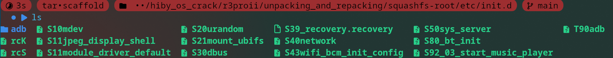
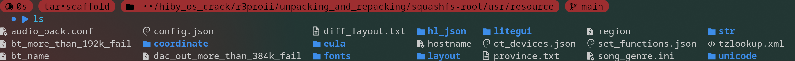

# Rootfs Structure

## /etc/init.d/

- in `/etc/init.d` there are initializing and un-initializing scripts
- the main init script is `rcS`. it runs anything in the `/etc/init.d` directory that fits the format `S??*`, doing so in numerical order
    - for example, it would run `S10mdev`, then `S11jpeg_display_shell`, then `S11module_driver_default`, then `S20urandom`, and so on
- the main un-init script is `rcK`, it uses the same match format of `S??*`, but loops through the files in reverse order. it sends a stop signal to each

**Oddities:**
- the file `T90adb`
    - it does not match as an init script
    - from what i can tell, it was renamed by hiby for the production release of the firmware in order to disable adb debugging functionality
    - (TODO) needs testing, but i believe that renaming this file to `S90adb` re-enables adb debug functionality. it might add a "Dock" option to usb working mode menu
- the `adb/` folder
    - it not get directly run by `rcS` because it does not match on the `S??*` selector
    - the contained scripts are, instead, child scripts of `T90adb`


## /usr/resource/

- this folder contains most of the device configuration
- it also includes the files that the `hiby_player` binary depends on (like images, layout, etc.)

### /usr/resource/layout/
- there are 2 folders in here, `theme1/` and `theme2/`
- `theme1` is the light theme, and `theme2` is the dark theme
- there's a whole lot of repetition between `theme1` and `theme2`
    - this could be a good avenue for saving space if that was needed (maybe symlinks or something?)
- this folder contains a bunch of `.view` files, which determine the layout the whole gui
    - from my work decompiling `hiby_player`, it seems that listviews (such as the playlist menu or the settings menu, etc.) get populated by `hiby_player` rather than being stored somewhere

### /usr/resource/litegui/
- there are 2 folders in here, `theme1/` and `theme2/`. exactly the same as in `/usr/resource/layout/`
- this folder contains all of the images for the gui

### /usr/resource/str/
- this folder contains a folder for each supported language
- this folder is used to fetch the translated text used in the gui
- each language has the same set of files, but with the contents changed based on the language
- the folder uses `.ini` files formatted as shown below
```
<?Python version="3.9.7" encoding="utf-16"?>
<resources>
  <player>Player</player>
  <fm>FM</fm>
  <step>Step</step>
  <book>Book</book>
  <abo_dev>About</abo_dev>
  <sys_set>System settings</sys_set>
  <theme>Theme</theme>
</resources>
```

